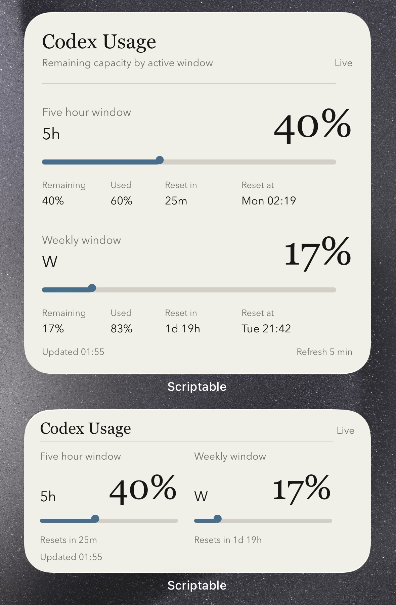

# Codex Usage Scriptable Widgets

Scriptable widgets for showing Codex usage on an iPhone or iPad Home Screen.

This repository is intentionally small. It only contains four public-facing Scriptable components and a preview image. It does not include any sync scripts, server configuration, tokens, logs, or private infrastructure details.



## Widgets

- `Scriptable/CodexUsageWidget.js`: the original compact widget with simple progress bars and remaining percentage.
- `Scriptable/CodexUsage_MuseumLabel.js`: a museum-label style widget with restrained typography, fine rules, and expanded reset details in the large widget.
- `Scriptable/CodexUsage_MuseumLabel_weekonly.js`: a compact weekly-only museum-label version, designed to fit each Scriptable widget family without clipping.
- `Scriptable/CodexUsage_Bars_weekonly.js`: a bold weekly-only version with a high-legibility progress bar.

`CodexUsage_MuseumLabel.js` was designed with OpenAI Codex using the `design-taste-frontend` skill.

All four widgets support Scriptable small, medium, and large widget families.

## Privacy

The widgets only read a JSON file from the HTTPS endpoint you configure. They do not store Codex tokens on your iPhone, and this public repository does not include any backend implementation.

Do not commit:

- Codex tokens, OpenAI tokens, or `.codex/auth.json`
- Server IP addresses, SSH usernames, server paths, upload URLs, or upload tokens
- Sync scripts, scheduled task scripts, service initialization scripts, logs, or state files
- Your real personal usage JSON URL if it reveals private infrastructure

Before using a widget, replace the placeholder endpoint at the top of the file:

```javascript
const ENDPOINT = "https://example.com/codex-usage.json";
```

## Expected JSON

Your endpoint should return JSON shaped like this:

```json
{
  "stale": false,
  "status": "ok",
  "updatedAtLocal": "2026-07-05 20:09:50",
  "fiveHour": {
    "remainingPercent": 86,
    "usedPercent": 14,
    "resetAfterSeconds": 4061,
    "resetAt": "2026-07-05T13:17:31Z"
  },
  "weekly": {
    "remainingPercent": 32,
    "usedPercent": 68,
    "resetAfterSeconds": 178337,
    "resetAt": "2026-07-07T21:42:07Z"
  },
  "display": {
    "short": "5h 86% W 32%",
    "line1": "5h 86%",
    "line2": "W 32%"
  }
}
```

`CodexUsageWidget.js` mainly uses `remainingPercent`, `resetAfterSeconds`, `stale`, and `updatedAtLocal`.

`CodexUsage_MuseumLabel.js` also uses `usedPercent` and `resetAt` for the expanded large widget layout.

`CodexUsage_MuseumLabel_weekonly.js` reads only `weekly`. Its `usedPercent` field is optional and is calculated from `remainingPercent` when absent. The minimum payload for this widget is:

```json
{
  "stale": false,
  "status": "ok",
  "updatedAtLocal": "2026-07-13 20:09:50",
  "weekly": {
    "remainingPercent": 32,
    "resetAfterSeconds": 178337
  }
}
```

Both weekly-only widgets use representative preview data when run directly in Scriptable, so the layout can be reviewed before a real endpoint is configured. In an installed widget, a failed request still displays the normal stale state.

## Usage

1. Install [Scriptable](https://scriptable.app/) on your iPhone or iPad.
2. Create a new Scriptable script.
3. Copy the contents of the Scriptable style you want, including either weekly-only version.
4. Replace `ENDPOINT` with your own HTTPS JSON endpoint.
5. Run the script inside Scriptable to preview it.
6. Add a Scriptable widget to your Home Screen and select the script.

The widgets request fresh data every 5 minutes, but iOS may adjust the actual refresh schedule.

## What This Repository Does Not Do

This repository does not call the Codex API directly and does not generate the usage JSON.

You need your own private sync process that converts Codex usage into the safe JSON format above and publishes it to an HTTPS endpoint your device can read.

## License

MIT
