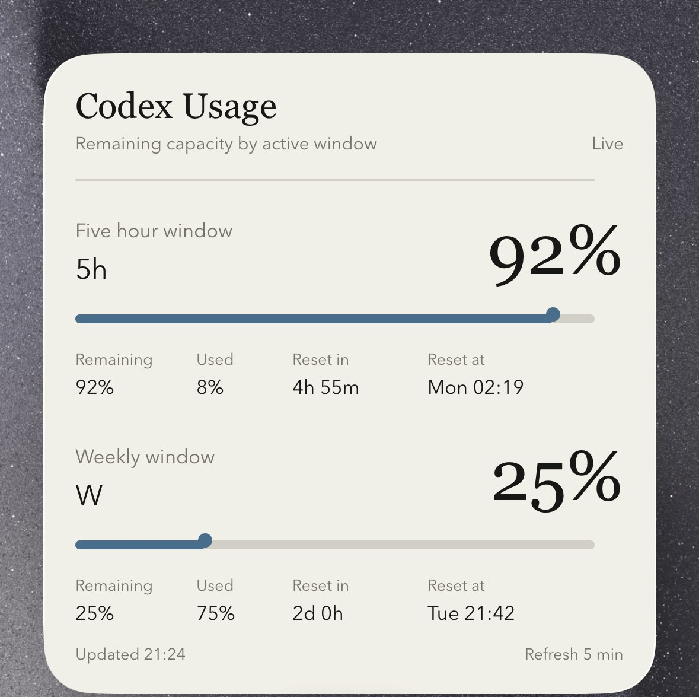

# Codex Usage Scriptable Widgets

这是一个用于在 iPhone 或 iPad 主屏幕显示 Codex 用量的 Scriptable 小组件仓库。

这个仓库刻意保持很小。它只包含两个适合公开的 Scriptable 展示组件和一张效果图，不包含同步脚本、服务器配置、token、日志或任何私有基础设施信息。



## 小组件

- `Scriptable/CodexUsageWidget.js`：基础版本，使用简洁进度条和剩余百分比展示用量。
- `Scriptable/CodexUsage_MuseumLabel.js`：画廊展签风格版本，使用克制排版、细分隔线，并在 large 小组件中展示更完整的重置详情。

`CodexUsage_MuseumLabel.js` 的视觉方向由 OpenAI Codex 借助 `design-taste-frontend` skill 辅助完成。

两个组件都支持 Scriptable 的 small、medium、large 三种小组件尺寸。

## 隐私边界

小组件只会读取你配置的 HTTPS JSON 地址。它们不会在 iPhone 上保存 Codex token，这个公开仓库也不包含任何后端实现。

请不要提交：

- Codex token、OpenAI token 或 `.codex/auth.json`
- 服务器 IP、SSH 用户名、服务器路径、上传接口或上传 token
- 同步脚本、定时任务脚本、服务端初始化脚本、日志或 state 文件
- 会暴露私人基础设施的真实个人用量 JSON 地址

使用任一组件前，请替换文件顶部的占位地址：

```javascript
const ENDPOINT = "https://example.com/codex-usage.json";
```

## 期望的 JSON 格式

你的接口应返回类似下面的 JSON：

```json
{
  "stale": false,
  "status": "ok",
  "updatedAtLocal": "2026-07-05 20:09:50",
  "fiveHour": {
    "remainingPercent": 86,
    "usedPercent": 14,
    "resetAfterSeconds": 4061,
    "resetAt": "2026-07-05T13:17:31Z"
  },
  "weekly": {
    "remainingPercent": 32,
    "usedPercent": 68,
    "resetAfterSeconds": 178337,
    "resetAt": "2026-07-07T21:42:07Z"
  },
  "display": {
    "short": "5h 86% W 32%",
    "line1": "5h 86%",
    "line2": "W 32%"
  }
}
```

`CodexUsageWidget.js` 主要使用 `remainingPercent`、`resetAfterSeconds`、`stale` 和 `updatedAtLocal`。

`CodexUsage_MuseumLabel.js` 还会使用 `usedPercent` 和 `resetAt` 来展示 large 小组件中的扩展信息。

## 使用方法

1. 在 iPhone 或 iPad 上安装 [Scriptable](https://scriptable.app/)。
2. 在 Scriptable 中新建一个脚本。
3. 复制 `Scriptable/CodexUsageWidget.js` 或 `Scriptable/CodexUsage_MuseumLabel.js` 的内容。
4. 将 `ENDPOINT` 替换为你自己的 HTTPS JSON 地址。
5. 在 Scriptable 中运行脚本预览效果。
6. 添加 Scriptable 主屏幕小组件，并选择这个脚本。

组件会每 5 分钟请求一次新数据，但 iOS 可能会调整实际刷新频率。

## 这个仓库不做什么

这个仓库不直接调用 Codex API，也不负责生成用量 JSON。

你需要自己准备一个私有同步流程，把 Codex 用量转换成上面的安全 JSON 格式，并发布到你的设备可以访问的 HTTPS 地址。

## License

MIT
